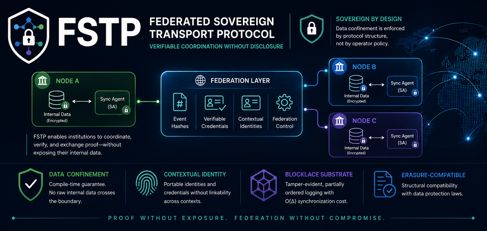
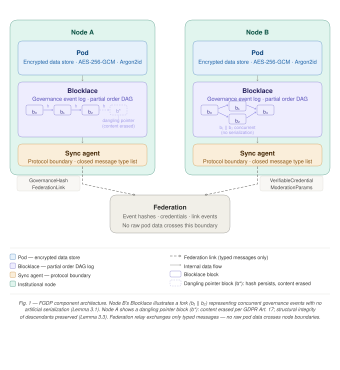
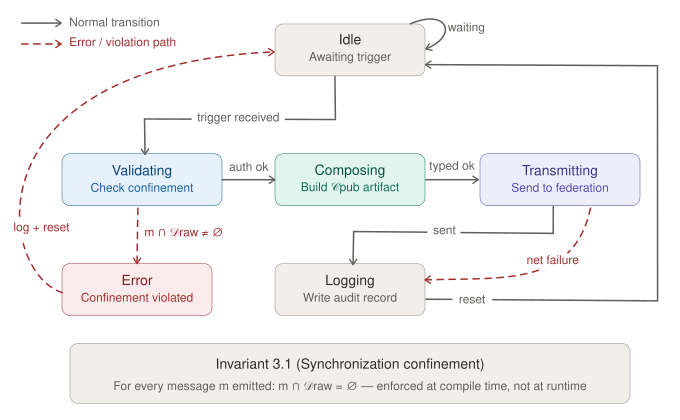

<p align="center">
  
</p>


# FSTP — Federated Sovereign Transport Protocol

[](https://github.com/rsotoc/fstp/actions/workflows/ci.yml)
[](LICENSE)

**Verifiable coordination without disclosure.**

FSTP is a synchronization boundary and transport layer for federated networks where each node may hold sensitive data under its own custody—yet still coordinate with other pods. The protocol makes **data confinement a structural property**: what may leave the node is defined by a closed, auditable message vocabulary, not by operational policy alone.

<p align="center">
  
</p>

## Why FSTP exists

Many organizations—**trade unions**, **political parties**, **cooperatives**, **public-interest pods**—need to:

- Keep deliberation records, membership data, and credentials on **infrastructure they control**
- Still **verify** that another pod held a vote, issued a credential, or reached an outcome
- **Federate** with peers without copying raw internal state across the network

FSTP provides a **reference Synchronization Agent (SA)** and a **`fstp-core` library** so deployers and integrators can audit the confinement boundary before trusting a federation link.

## The core guarantee

A federation participant can verify that a process occurred, that a credential is authentic, and that an outcome is uncorrupted — **without accessing the internal data that produced these artifacts**.

## Repository layout

```
fstp/
├── crates/
│   ├── fstp-core/     # Protocol primitives (import in your platform)
│   └── fstp-agent/    # Reference SA binary (Axum + mTLS + gRPC)
├── docs/              # Whitepaper (LaTeX), figures, docs index
├── .env.example       # Agent configuration template
├── CONTRIBUTING.md    # How to audit message.rs before federating
├── SECURITY.md        # Vulnerability reporting
└── CITATION.cff       # Software / paper citation metadata
```

## Three protocol primitives (§3)

| Primitive | Location | Role |
|-----------|----------|------|
| **Synchronization Agent** | `sa_machine.rs`, `message.rs` | Exclusive boundary; closed `FstpMessage` enum (Table 2) |
| **Contextual identity** | `identity.rs` | HKDF-derived CIIs, unlinkable across federation links |
| **Blocklace** | `blocklace.rs` | Tamper-evident DAG; O(Δ) sync; erasure via dangling pointers |

<p align="center">
  
</p>

## Quick start

```bash
git clone https://github.com/rsotoc/fstp.git
cd fstp

# Protocol demo (no network, no TLS)
cargo run --example two_nodes -p fstp-core

# Full test suite
cargo test --workspace

# Benchmarks (HTML report under target/criterion/)
cargo bench -p fstp-core
```

## Deploy the reference agent

```bash
cp .env.example .env
./scripts/gen-dev-certs.sh   # once — creates certs/server.crt + server.key (gitignored)
# HU-03: paste FSTP_TRUSTED_ISSUERS_JSON from smoke step [7] into .env (single-quoted JSON)
cargo run -p fstp-agent      # loads .env automatically from fstp/ (or fstp/.env from repo root)
```

`certs/` is gitignored. For production PKI see [`docs/MTLS-PRODUCTION.md`](docs/MTLS-PRODUCTION.md).

### Register a federation peer

```bash
curl -X POST https://127.0.0.1:8080/fstp/admin/peers \
  -H 'Content-Type: application/json' \
  --cacert certs/server.crt \
  -d '{
    "peer_cii": "cii:node-b-for-link-ab",
    "link_id": "550e8400-e29b-41d4-a716-446655440001",
    "cert_fingerprint": "aa:bb:cc:...",
    "endpoint_url": "https://node-b.example.org",
    "peer_pubkey_hex": "..."
  }'
```

### Health check

```bash
curl https://your-node/fstp/health
```

Returns chain integrity, frontier size, peer count, and audit record count.

## Phase 2 — portable identity hooks

| Endpoint | Auth | Purpose |
|----------|------|---------|
| `POST /fstp/present-credential` | mTLS peer | Federated VC presentation; derives `subject_cii` via HKDF |
| `POST /fstp/federation/control` | mTLS peer | Federation lifecycle events → Blocklace |
| `POST /rpc/verify-credential` | Loopback | HTTP proxy for credential verification |
| gRPC `VerifyCredential` | Loopback | JVM / platform integration on `FSTP_GRPC_ADDR` |

Signed frontier exchange uses `NodeSigner` (`fstp-core/src/crypto.rs`). Trusted issuers: `FSTP_TRUSTED_ISSUERS_JSON`. Use `FSTP_GRPC_TRUST_CALLER_PUBKEY=true` **only** in local development.

## Phase 3 — Ágora integration & active sync

| Endpoint | Auth | Purpose |
|----------|------|---------|
| `POST /pod-agent/v1/federation/present-passport` | `X-Pod-Agent-Key` | HU-06: Ágora → source SA → target `present-credential` |
| `POST /fstp/admin/sync?link_id=…` | `X-Pod-Agent-Key` | Trigger O(Δ) frontier sync with a registered peer |
| `POST /fstp/admin/peers` | `X-Pod-Agent-Key` | Register peer DID, endpoint, TLS fingerprint |

Configure Ágora with `agora.pod-agent.outbound-base-url=https://your-sa/pod-agent/v1` (not the Java stub path). Register federation peers on each SA and add the source DID to the target's `FSTP_TRUSTED_ISSUERS_JSON`.

**Local dev flags** (never in production): `FSTP_DEV_INSECURE_OUTBOUND`, `FSTP_DEV_TRUST_PRESENT_CREDENTIAL` — see `.env.example`. Set `FSTP_PROFILE=production` to abort startup if any dev flag is enabled ([`docs/MTLS-PRODUCTION.md`](docs/MTLS-PRODUCTION.md)).

**Documentation:** [`docs/WHITEPAPER-CODE-MAP.md`](docs/WHITEPAPER-CODE-MAP.md) (code ↔ paper), [`docs/IDENTIDAD-HU03.md`](docs/IDENTIDAD-HU03.md), [`docs/PEER-BOOTSTRAP.md`](docs/PEER-BOOTSTRAP.md).

## Phase 4 — residence, federation callbacks & periodic sync

| Endpoint | Auth | Purpose |
|----------|------|---------|
| `POST /pod-agent/v1/residences/grant` | `X-Pod-Agent-Key` | HU-04: derive `subject_cii` + Blocklace `MembershipChange` |
| `POST /pod-agent/v1/residences/revoke` | `X-Pod-Agent-Key` | HU-04: record revocation in Blocklace |
| *(outbound)* `POST …/federation/events` | `X-Pod-Agent-Key` → Ágora | After `federation/control`, SA notifies Ágora |
| `FSTP_SYNC_INTERVAL_SECS` | — | Background O(Δ) sync with all registered peers |

Ágora calls `PodResidenceOutboundClient` → `/residences/grant` on the local SA when `stub-mode=false`.

## Use as a library

```toml
[dependencies]
fstp-core = { git = "https://github.com/rsotoc/fstp", tag = "v0.1.0" }
```

```rust
use fstp_core::{InMemoryBlocklace, BlocklaceStore, NodeSigner};

let signer = NodeSigner::from_seed(&your_32_byte_seed);
let mut bl = InMemoryBlocklace::new();
```

Platform-specific HTTP contracts belong in the integrating application; FSTP documents only the protocol boundary.

## Documentation

- **[docs/README.md](docs/README.md)** — whitepaper source, figures, PDF build
- **[docs/GITHUB_SETUP.md](docs/GITHUB_SETUP.md)** — first-time private repo on GitHub
- **[docs/CRATES_IO.md](docs/CRATES_IO.md)** — publish `fstp-core` on crates.io
- **[docs/FSTP-techPaper.tex](docs/FSTP-techPaper.tex)** — technical paper (LaTeX)
- **[CONTRIBUTING.md](CONTRIBUTING.md)** — audit procedure for `message.rs`

## Security model

FSTP does not protect against a malicious **node administrator** with authorized access to the data store. Mitigations within the architecture: open-source SA code auditable before deployment; local audit log of all outbound federation activity; SA version declarable in the node DID document for peer verification.

Report vulnerabilities per **[SECURITY.md](SECURITY.md)**.

## Roadmap (open source)

| Channel | Status |
|---------|--------|
| **GitHub** ([rsotoc/fstp](https://github.com/rsotoc/fstp)) | Private bootstrap → public release when ready |
| **[crates.io](https://crates.io/)** | Planned (`fstp-core`, then agent tooling) |
| **Academic paper** | Source in `docs/`; citation via `CITATION.cff` |

## Contributing

See [CONTRIBUTING.md](CONTRIBUTING.md) and [CODE_OF_CONDUCT.md](CODE_OF_CONDUCT.md).

## License

Apache 2.0 — see [LICENSE](LICENSE). The license is intentional: peers must be able to inspect, compile, and run the SA to verify the confinement claim.
