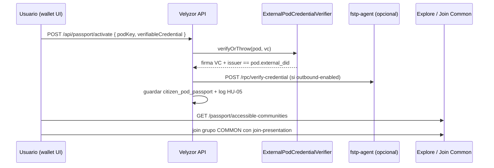

# HU-03 — Pasaporte a Velyzor Common

**Índice:** IP-01 en [`INDICE-ESTADO-2026-05.md`](../../velizor-dev-docs/tickets/INDICE-ESTADO-2026-05.md) §3.1  
**Whitepaper:** §4 (coordination without disclosure), §5 (deployment con SA)  
**Contrato:** [`agora-pod-agent-v1.md`](../../velizor-dev-docs/contracts/agora-pod-agent-v1.md) — fila HU-03

---

## Objetivo

Un ciudadano con credencial emitida por un **Pod externo** activa un **pasaporte** en Velyzor Common y accede a grupos `COMMON` cuyas políticas aceptan esa VC, **sin** depositar la credencial en el servidor de forma permanente más allá del snapshot acordado (accountability HU-05).

---

## Flujo end-to-end (implementado)

### Superficie API (Velyzor)

| Método | Ruta | Uso |
|--------|------|-----|
| `GET` | `/api/passport/status` | Estado pasaporte activo |
| `GET` | `/api/passport/pods` | Pods externos (`platform_common=false`) |
| `POST` | `/api/passport/activate` | Activar pasaporte (HU-03) |
| `DELETE` | `/api/passport` | Desactivar |
| `GET` | `/api/passport/accessible-communities` | Grupos Common accesibles |
| `GET` | `/api/passport/join-presentation/{communityId}` | Presentation para join |

### Frontend

| Componente | Ruta / acción |
|------------|----------------|
| `PassportSection.jsx` | Perfil → wallet → “Usar pasaporte” |
| `Dashboard.jsx?explore=passport` | Explorar solo grupos accesibles |
| `CommunityDetailModal.jsx` | Join con `getJoinPresentation` en política APPROVAL |

### Agente FSTP

| Componente | Rol HU-03 |
|------------|-----------|
| `verify_credential.rs` / `POST /rpc/verify-credential` | Segunda opinión criptográfica (emisor en `IssuerRegistry` / `FSTP_TRUSTED_ISSUERS_JSON`) |
| `velyzor_notify.rs` | Opcional: notificar presentación tras federación |

---

## Criterios de aceptación ↔ estado

| Criterio | Estado | Evidencia |
|----------|--------|-----------|
| Usuario elige Pod externo y pega VC JSON | ✅ | `PassportSection`, `ActivatePassportRequest` |
| Rechazo si Pod es `agora-common` | ✅ | `ExternalPodCredentialVerifier` |
| Emisor VC coincide con `pod_directory.external_did` | ✅ | `ExternalPodCredentialVerifier` |
| Verificación firma / expiración VC | ✅ | `VerifiableCredentialService` |
| Verificación adicional vía SA cuando producción | 🟡 | `ExternalPodCredentialVerifier` → `POST {SA}/rpc/verify-credential` vía `PodAgentRestClientFactory.createForAgentRoot()` (perfil `fstp-staging`) |
| Listar y unirse a grupos Common compatibles | ✅ | `listAccessibleCommonCommunities`, explore + join |
| Registro accountability | ✅ | `CredentialPresentationLogService.recordPassportActivation` |
| mTLS Velyzor ↔ SA en producción | 🔴 → doc | [`MTLS-PRODUCTION.md`](./MTLS-PRODUCTION.md) |
| Emisor Pod en `FSTP_TRUSTED_ISSUERS_JSON` del SA Common | 🟡 | Operación: registrar DID + pubkey del Pod emisor |

---

## DID emisor real (`did:key`)

Tutorial paso a paso: [`velizor-dev-docs/tutorials/TUTORIAL-DID-KEY-REAL.md`](../../velizor-dev-docs/tutorials/TUTORIAL-DID-KEY-REAL.md)  
Atajo local: `cd sos-backend && ./gradlew generatePodDemoDid -PpodKey=pod-demo-alpha`

---

## Cierre operativo (checklist sin compilar aquí)

1. **Datos:** filas en `pod_directory` con `external_did` del Pod emisor (no Common).
2. **SA Common:** `FSTP_TRUSTED_ISSUERS_JSON` incluye DID + `pubkeyHex` del Pod.
3. **Velyzor:** `velizor.pod-agent.stub-mode=false`, `outbound-enabled=true`, `POD_AGENT_BASE_URL` → SA con mTLS.
4. **Prueba manual:** activar pasaporte con VC de demo → explorar `?explore=passport` → join a grupo COMMON con política abierta o VC coincidente.
5. **Logs:** entrada `PASSPORT_ACTIVATION` en `credential_presentation_log`.

---

## Gaps conocidos (fuera de HU-03 estricto)

- Obtención de la VC desde el Pod origen (wallet del Pod) no está automatizada en UI; el usuario pega JSON (PMV).
- Revocación cruzada Pod ↔ Common vía federación es HU-06 / residencia, no pasaporte.

---

*Mayo 2026 — documentación FSTP; validación de compilación y E2E en entorno local del operador.*
